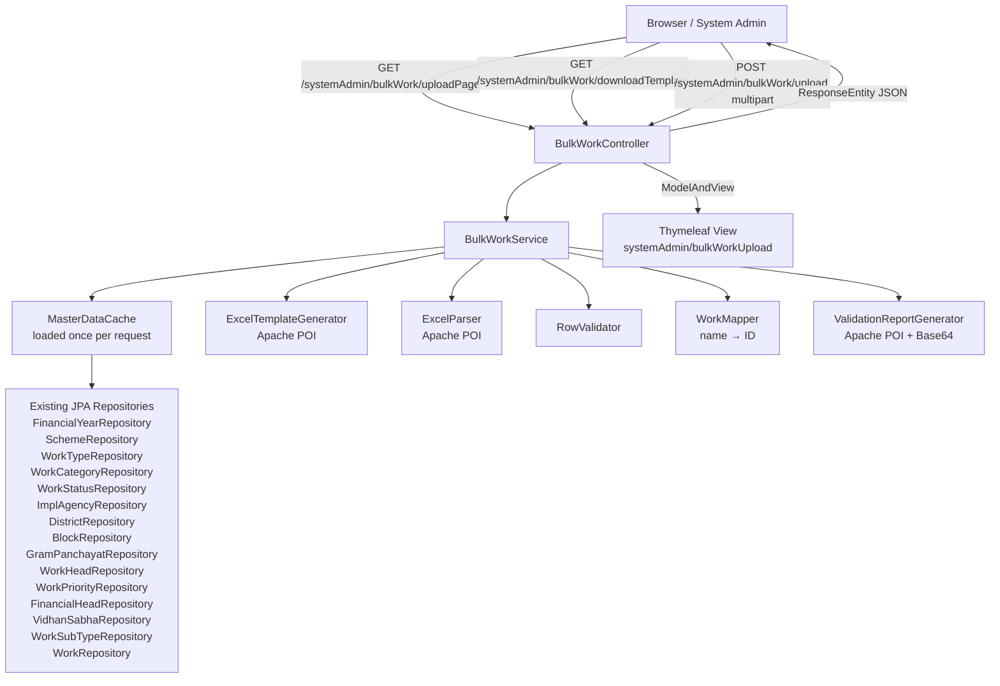

# Design Document: Bulk Work Creation

## Overview

The Bulk Work Creation feature adds an Excel-based batch import workflow to the Anuppur DMS System Admin section. A System Admin downloads a predefined `.xlsx` template, fills in work data, uploads the completed file, and receives a JSON summary with row-level validation results. Valid rows are persisted to `t_work`; invalid rows are reported in a downloadable Base64-encoded validation report.

The feature is implemented as a new `BulkWorkController` under the existing `/systemAdmin` path, backed by a new `BulkWorkService`. It reuses all existing JPA repositories, the `Work` entity, Spring Security, and Apache POI (already in `pom.xml` at version 4.1.2).

---

## Architecture



The controller is a `@RestController` (matching the existing pattern in `SystemAdminController`) annotated with `@PreAuthorize("hasRole('ROLE_SYSTEM_ADMIN')")`. The service is a Spring `@Service` with `@Transactional` on the upload method.

---

## Components and Interfaces

### BulkWorkController

```
package com.anuppur.controller

@RestController
@RequestMapping("/systemAdmin/bulkWork")
@PreAuthorize("hasRole('ROLE_SYSTEM_ADMIN')")
public class BulkWorkController extends BaseController {

    // GET /systemAdmin/bulkWork/uploadPage
    ModelAndView uploadPage(HttpServletRequest request)

    // GET /systemAdmin/bulkWork/downloadTemplate
    ResponseEntity<byte[]> downloadTemplate()

    // POST /systemAdmin/bulkWork/upload
    ResponseEntity<BulkUploadResultBean> upload(
        @RequestParam("file") MultipartFile file,
        HttpServletRequest request)
}
```

The controller delegates all logic to `BulkWorkService`. It retrieves the authenticated username via `DMSUtil.getUserDetail().getUsername()` (existing pattern).

### BulkWorkService (interface + impl)

```
package com.anuppur.service

public interface BulkWorkService {
    byte[] generateTemplate();
    BulkUploadResultBean processUpload(MultipartFile file, String username);
}
```

The implementation class `BulkWorkServiceImpl` is annotated `@Service` and `@Transactional`. It orchestrates:
1. File-level guard checks (size, row count, parsability)
2. Master data loading into in-memory maps (name → entity) — loaded once per call
3. Row-by-row parsing, validation, and mapping
4. Batch persistence of valid `Work` entities via `WorkRepository.saveAll()`
5. Validation report generation
6. Result bean assembly

### ExcelTemplateGenerator (internal helper, not a Spring bean)

Generates the `BulkWorkCreationTemplate.xlsx` using Apache POI `XSSFWorkbook`. Called by `BulkWorkService.generateTemplate()`.

- Sheet 1 (`Data Entry`): one frozen header row with 25 columns (see Requirements 1.3)
- Sheet 2 (`Reference Data`): one column per lookup, populated from all enabled master records

### RowValidator (internal helper)

Stateless class that takes a `BulkWorkRowBean` and a `MasterDataCache` and returns a `List<RowErrorBean>`. Applies all 14 validation rules from Requirement 4.

### WorkMapper (internal helper)

Converts a validated `BulkWorkRowBean` + `MasterDataCache` into a `Work` entity ready for persistence.

---

## Data Models

### BulkWorkRowBean

Intermediate DTO representing one parsed Excel row. All fields are `String` to preserve raw input for error reporting.

```java
package com.anuppur.bean

public class BulkWorkRowBean {
    private int rowNumber;          // 1-based Excel row number (excluding header)
    private String workName;
    private String workNo;
    private String financialYearName;
    private String schemeName;
    private String workTypeName;
    private String workCategoryName;
    private String workSubTypeName;
    private String workStatusName;
    private String workPriorityName;
    private String workHeadName;
    private String financialHeadName;
    private String implementationAgencyName;
    private String districtName;
    private String blockName;
    private String gramPanchayatName;
    private String vidhanSabhaName;
    private String estimatedAmount;
    private String amtReleasedTillDate;
    private String allocatedAmount;
    private String startDate;
    private String multifundedStatus;
    private String fundByState;
    private String fundByNhm;
    private String fundByEcrp2;
    private String fundByOthers;
    // getters/setters
}
```

### RowErrorBean

```java
package com.anuppur.bean

public class RowErrorBean {
    private int rowNumber;
    private String columnName;
    private String errorMessage;
    // getters/setters
}
```

### BulkUploadResultBean

JSON response body returned by the upload endpoint.

```java
package com.anuppur.bean

public class BulkUploadResultBean {
    private int totalRows;
    private int successCount;
    private int failureCount;
    private String message;
    private List<RowErrorBean> errors;
    private String validationReportBase64;  // null when no failures
    // getters/setters
}
```

### MasterDataCache (internal, not a bean)

```java
// package-private inner class or separate class in service package
class MasterDataCache {
    Map<String, Long> financialYearMap;   // name → id
    Map<String, Long> schemeMap;
    Map<String, Long> workTypeMap;
    Map<String, Long> workCategoryMap;
    Map<String, Long> workSubTypeMap;
    Map<String, Long> workStatusMap;
    Map<String, Long> implAgencyMap;
    Map<String, Long> districtMap;        // name → id (also need districtCode)
    Map<String, String> districtCodeMap;  // name → code
    Map<String, Long> blockMap;
    Map<String, String> blockCodeMap;
    Map<String, Long> gramPanchayatMap;
    Map<String, Long> workHeadMap;
    Map<String, Long> workPriorityMap;
    Map<String, Long> financialHeadMap;
    Map<String, Long> vidhanSabhaMap;
    Set<String> existingWorkNos;          // for duplicate check
}
```

---

## Work Entity Field Mapping

The following table shows how each Excel column maps to a `Work` entity field:

| Excel Column | Work Field | Notes |
|---|---|---|
| Work Name | `workName` | direct string |
| Work No | `workNo` | direct string, optional |
| Financial Year Name | `financialYear` | resolved to `FinancialYear.id` |
| Scheme Name | `scheme` | resolved to `Schemes.id` |
| Work Type Name | `workType` + `worTypeId` | resolved to `WorkType.workTypeId` |
| Work Category Name | `workCategoryId` | resolved to `WorkCategory.id` |
| Work Sub Type Name | `workSubtypeId` | resolved to `WorkSubType.id`, optional |
| Work Status Name | `workStatus` | resolved to `WorkStatus.id` |
| Work Priority Name | `workPriorityId` | resolved to `WorkPriority.id`, optional |
| Work Head Name | `workHead` | resolved to `WorkHead.id`, optional |
| Financial Head Name | `financialHeadId` | resolved to `FinancialHead.id`, optional |
| Implementation Agency Name | `implementationAgency` | resolved to `ImplementationAgency.id` |
| District Name | `districtId` + `districtCode` | resolved to `District.id` and `District.districtCode` |
| Block Name | `blockId` + `blockCode` | resolved to `Block.id` and `Block.blockCode` |
| Gram Panchayat Name | `gramPanchayatId` + `gramPanchayatCode` | optional |
| Vidhan Sabha Name | `vidhanSabhaId` | optional |
| Estimated Amount | `estimatedAmt` | `BigDecimal` |
| Amount Released Till Date | `amtReleasedTillDate` | `BigDecimal`, optional |
| Allocated Amount | `allocatedAmount` | `BigDecimal`, optional |
| Start Date | `startDate` | stored as `String` in `DD/MM/YYYY` format |
| Multifunded Status | `multifundedStatus` | `"Y"` or `"N"` |
| Fund By State | `fundByState` | `BigDecimal`, conditional |
| Fund By NHM | `fundByNhm` | `BigDecimal`, conditional |
| Fund By ECRP2 | `fundByEcrp2` | `BigDecimal`, conditional |
| Fund By Others | `fundByOthers` | `BigDecimal`, conditional |

Fields set programmatically (not from Excel):
- `status` → `"A"` (Active)
- `createdBy` → authenticated username (via `Auditable` + `AuditorAwareImpl`, already wired)

---

## Correctness Properties

*A property is a characteristic or behavior that should hold true across all valid executions of a system — essentially, a formal statement about what the system should do. Properties serve as the bridge between human-readable specifications and machine-verifiable correctness guarantees.*

### Property 1: Row validation completeness

*For any* uploaded Excel file, every row that violates at least one validation rule (mandatory field missing, lookup name not found, invalid numeric, invalid date format, duplicate work number) must appear in the error list with a non-empty column name and error message, and must not be persisted.

**Validates: Requirements 4.1, 4.2, 4.3, 4.4, 4.5, 4.6, 4.7, 4.8, 4.9, 4.10, 4.11, 4.12, 4.13, 4.14**

### Property 2: Valid row persistence round-trip

*For any* row that passes all validations, the persisted `Work` entity must have all name-based fields resolved to their correct database IDs, `status` set to `"A"`, and `createdBy` set to the authenticated username.

**Validates: Requirements 5.1, 5.2, 5.3, 5.4**

### Property 3: Partial success isolation

*For any* batch containing a mix of valid and invalid rows, the count of persisted `Work` records must equal the number of valid rows, and no invalid row must produce a persisted record.

**Validates: Requirements 5.5, 5.6**

### Property 4: Response summary accuracy

*For any* upload, the `BulkUploadResultBean` returned must satisfy: `totalRows = successCount + failureCount`, `successCount` equals the number of newly persisted works, and `failureCount` equals the number of rows in the error list.

**Validates: Requirements 6.1**

### Property 5: Validation report inclusion

*For any* upload where `failureCount > 0`, the `validationReportBase64` field in the response must be non-null and must decode to a valid `.xlsx` file containing at least one error row.

**Validates: Requirements 6.2**

---

## Error Handling

| Scenario | Handling |
|---|---|
| File > 5 MB | Return `BulkUploadResultBean` with `message = "File size must not exceed 5 MB"`, no report |
| Empty file / header-only | Return `BulkUploadResultBean` with `message = "The uploaded file contains no data rows"` |
| > 500 rows | Return `BulkUploadResultBean` with `message = "A maximum of 500 rows are allowed per upload"` |
| Unparseable file | Return `BulkUploadResultBean` with `message = "The uploaded file is not a valid Excel (.xlsx) file"` |
| Row-level validation failure | Collect `RowErrorBean`, skip persistence for that row, continue processing |
| All rows fail | Return `BulkUploadResultBean` with `message = "No records were created. Please review the validation report"` and include report |
| All rows succeed | Return `BulkUploadResultBean` with `message = "All [N] work records created successfully"`, no report |
| Unexpected exception during persistence | Log with SLF4J at ERROR level, return 500 with generic error message |

File-level guard checks are performed before any row parsing. Row-level errors are non-fatal — processing continues to the next row. The `@Transactional` boundary on `processUpload` ensures that if a database error occurs mid-batch, already-saved rows within the same transaction are rolled back; however, the design uses `saveAll()` on the full valid list at the end, so partial DB failures are unlikely.

---

## Testing Strategy

Since the project has no test cases requirement, this section documents the testing approach for future reference.

### Unit Testing

Focus on specific examples and edge cases:

- `ExcelTemplateGenerator`: verify the generated workbook has 2 sheets, correct column headers in order, and reference data populated
- `RowValidator`: test each of the 14 validation rules with a specific invalid input and verify the correct error message is returned
- `WorkMapper`: test that a fully valid `BulkWorkRowBean` + `MasterDataCache` produces a `Work` entity with all fields correctly set
- `BulkWorkService` file-level guards: test the 5 MB limit, empty file, 501-row file, and non-xlsx file scenarios

### Property-Based Testing

If property-based testing is added in the future, the recommended library for Java is **jqwik** (compatible with JUnit 5) or **QuickTheories** (JUnit 4 compatible, matching the project's Spring Boot 1.5.x era).

Each property test should run a minimum of 100 iterations and be tagged with a comment referencing the design property:

```java
// Feature: bulk-work-creation, Property 1: Row validation completeness
@Property
void rowValidationCompleteness(@ForAll BulkWorkRowBean invalidRow) { ... }

// Feature: bulk-work-creation, Property 2: Valid row persistence round-trip
@Property
void validRowPersistenceRoundTrip(@ForAll BulkWorkRowBean validRow) { ... }

// Feature: bulk-work-creation, Property 3: Partial success isolation
@Property
void partialSuccessIsolation(@ForAll List<BulkWorkRowBean> mixedRows) { ... }

// Feature: bulk-work-creation, Property 4: Response summary accuracy
@Property
void responseSummaryAccuracy(@ForAll List<BulkWorkRowBean> rows) { ... }

// Feature: bulk-work-creation, Property 5: Validation report inclusion
@Property
void validationReportInclusion(@ForAll List<BulkWorkRowBean> rowsWithAtLeastOneInvalid) { ... }
```
