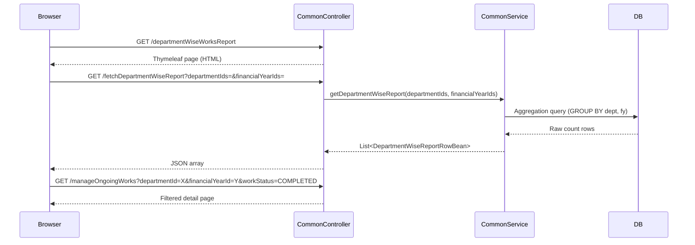

# Design Document: Department-wise Works Report

## Overview

The Department-wise Works Report is a summary page that aggregates work counts (Total, Completed, Ongoing, Not Started) grouped by department and financial year. Each count cell is a hyperlink that navigates to the existing `manageOngoingWorks` detail page pre-filtered by department, financial year, and work status. The page follows the same UI conventions as `manageOngoingWorks`, using bootstrap-select multiselect dropdowns for filtering.

The feature adds:
- A new Thymeleaf template: `common/departmentWiseWorksReport.html`
- A new backend endpoint in `CommonController` to serve the page and the aggregated data
- A new service method in `CommonService` / `CommonServiceImpl` for the aggregation query
- A new response bean `DepartmentWiseReportRowBean`

No new entities or database tables are required. The aggregation is computed via a JPQL/native query joining `t_work`, `department_remarks`, and `mst_department`.

---

## Architecture



The frontend uses AngularJS (consistent with the rest of the application) to call the data endpoint, populate the table, and build hyperlink URLs.

---

## Components and Interfaces

### Controller: `CommonController`

Two new mappings added to the existing `CommonController`:

```java
// Page view
@RequestMapping(value = "/departmentWiseWorksReport", method = RequestMethod.GET)
public ModelAndView departmentWiseWorksReportView(HttpServletRequest request)

// Data API
@RequestMapping(value = "/fetchDepartmentWiseReport", method = RequestMethod.GET,
                produces = "application/json;charset=UTF-8")
@ResponseBody
public List<DepartmentWiseReportRowBean> fetchDepartmentWiseReport(
    @RequestParam(required = false) String departmentIds,
    @RequestParam(required = false) String financialYearIds,
    HttpServletRequest request)
```

`departmentIds` and `financialYearIds` are comma-separated ID strings (e.g. `"1,3,5"`), consistent with how other multi-value filters are passed in this codebase.

### Service: `CommonService` / `CommonServiceImpl`

New method:

```java
List<DepartmentWiseReportRowBean> getDepartmentWiseReport(
    List<Long> departmentIds,
    List<Long> financialYearIds);
```

The implementation uses a native SQL query (via `WorkRepository` or a dedicated repository method) to perform the GROUP BY aggregation. When `financialYearIds` is empty/null, the query defaults to the latest financial year (max `id` in `mst_financial_year`).

Work status classification uses the `flag` column on `mst_work_status`:
- `flag = 1` → Completed
- `flag = 2` → Ongoing (in-progress)
- `flag = 3` → Not Started

(These flag values should be confirmed against the actual data; the design uses conditional COUNT with CASE expressions.)

### Bean: `DepartmentWiseReportRowBean`

```java
package com.anuppur.bean;

public class DepartmentWiseReportRowBean {
    private Long departmentId;
    private String departmentName;
    private Long financialYearId;
    private String financialYearName;
    private long totalWorks;
    private long completedWorks;
    private long ongoingWorks;
    private long notStartedWorks;
    // getters and setters
}
```

### Template: `common/departmentWiseWorksReport.html`

Follows the same structure as `manageOngoingWorks.html`:
- Bootstrap 3 + bootstrap-select for multiselect dropdowns
- AngularJS for data loading and filter application
- DataTables for the summary table
- Two `selectpicker` dropdowns: Department Name and Financial Year
- Table columns: S.No, Department Name, Financial Year, Total Works, Completed Work, Ongoing Work, Not Started Work
- Each count cell rendered as `<a href="#manageOngoingWorks?departmentId=...&financialYearId=...&workStatus=...">{{count}}</a>`

### Detail Report: `manageOngoingWorks` (existing, modified)

The existing `fetchWorksList` endpoint in `CommonController` already accepts `financialYear1` and `workStatusId` parameters. A `departmentId` parameter needs to be added to the filter chain so that the detail view can pre-filter by department.

The `manageOngoingWorks.html` template needs a hidden input or URL-parameter reader to pre-populate the department filter on load when `departmentId` is passed as a query parameter.

---

## Data Models

### Existing tables used

| Table | Key columns used |
|---|---|
| `t_work` | `id`, `financial_year` (FK → `mst_financial_year.id`), `work_status` (FK → `mst_work_status.id`) |
| `department_remarks` | `work_id` (FK → `t_work.id`), `department_master_id` (FK → `mst_department.id`) |
| `mst_department` | `id`, `name`, `enabled` |
| `mst_financial_year` | `id`, `financial_year` (label string e.g. "2024-25"), `enabled` |
| `mst_work_status` | `id`, `work_status_name_e`, `flag` |

### Aggregation query (native SQL)

```sql
SELECT
    d.id                          AS departmentId,
    d.name                        AS departmentName,
    fy.id                         AS financialYearId,
    fy.financial_year             AS financialYearName,
    COUNT(DISTINCT w.id)          AS totalWorks,
    COUNT(DISTINCT CASE WHEN ws.flag = 1 THEN w.id END) AS completedWorks,
    COUNT(DISTINCT CASE WHEN ws.flag = 2 THEN w.id END) AS ongoingWorks,
    COUNT(DISTINCT CASE WHEN ws.flag = 3 THEN w.id END) AS notStartedWorks
FROM mst_department d
JOIN department_remarks dr ON dr.department_master_id = d.id
JOIN t_work w              ON w.id = dr.work_id
JOIN mst_financial_year fy ON fy.id = w.financial_year
LEFT JOIN mst_work_status ws ON ws.id = w.work_status
WHERE d.enabled = 1
  AND (:departmentIds IS NULL OR d.id IN (:departmentIds))
  AND (:financialYearIds IS NULL OR fy.id IN (:financialYearIds))
  AND (
      :financialYearIds IS NOT NULL
      OR fy.id = (SELECT MAX(id) FROM mst_financial_year WHERE enabled = 1)
  )
GROUP BY d.id, d.name, fy.id, fy.financial_year
ORDER BY d.name, fy.financial_year
```

When no financial year filter is provided, the query restricts to the latest enabled financial year.

### `DepartmentWiseReportRowBean` (new)

Fields: `departmentId`, `departmentName`, `financialYearId`, `financialYearName`, `totalWorks`, `completedWorks`, `ongoingWorks`, `notStartedWorks`.

---

## Correctness Properties

*A property is a characteristic or behavior that should hold true across all valid executions of a system — essentially, a formal statement about what the system should do. Properties serve as the bridge between human-readable specifications and machine-verifiable correctness guarantees.*

### Property 1: Count decomposition invariant

*For any* department and financial year combination returned by the aggregation, the sum of `completedWorks + ongoingWorks + notStartedWorks` must be less than or equal to `totalWorks` (works with no status or an unclassified status are counted in total but not in any sub-bucket).

**Validates: Requirements 1.1, 5.4**

### Property 2: Zero-count rows are still hyperlinks

*For any* row in the report where a count value is 0, the rendered HTML for that cell must still contain an anchor (`<a>`) element with the correct `href` parameters.

**Validates: Requirements 2.9**

### Property 3: Filter narrows result set

*For any* non-empty list of department IDs passed as a filter, every row in the returned result must have a `departmentId` that is contained in the filter list.

**Validates: Requirements 3.3, 5.3**

### Property 4: Financial year filter narrows result set

*For any* non-empty list of financial year IDs passed as a filter, every row in the returned result must have a `financialYearId` that is contained in the filter list.

**Validates: Requirements 4.3, 5.3**

### Property 5: Default financial year is latest

*For any* call to the aggregation endpoint with no `financialYearIds` parameter, all returned rows must have a `financialYearId` equal to the maximum enabled financial year ID in `mst_financial_year`.

**Validates: Requirements 1.2, 4.4, 5.2**

### Property 6: Hyperlink URL encodes correct parameters

*For any* row with department ID `D`, financial year ID `FY`, and status `S`, the hyperlink URL for that status cell must contain `departmentId=D`, `financialYearId=FY`, and `workStatus=S` as query parameters.

**Validates: Requirements 2.5, 2.6, 2.7, 2.8, 6.1**

### Property 7: Detail report filter round-trip

*For any* `departmentId`, `financialYearId`, and `workStatus` passed as URL parameters to the detail report, every work record returned must match all three filter values (department, financial year, and status).

**Validates: Requirements 6.2, 6.3, 6.4, 6.5, 6.6**

### Property 8: Empty filter returns all departments

*For any* call to the aggregation endpoint with no `departmentIds` parameter, the set of department IDs in the result must equal the set of all enabled departments that have at least one work record in the target financial year(s).

**Validates: Requirements 3.4, 5.2**

---

## Error Handling

| Scenario | Handling |
|---|---|
| Database error during aggregation | `CommonServiceImpl` catches `Exception`, logs it, and the controller returns HTTP 500 with a JSON error body `{"errorMessage": "..."}` |
| Invalid (non-numeric) `departmentIds` or `financialYearIds` | `convertToList()` (already in `CommonController`) throws `NumberFormatException`; controller catches and returns HTTP 400 |
| No departments exist | Returns an empty JSON array `[]`; frontend shows an empty table |
| `workStatus` URL param not in `{COMPLETED, ONGOING, NOT_STARTED, ""}` | Detail report ignores unknown values and returns all works (treated as no-status filter) |

---

## Testing Strategy

### Unit tests

- `CommonServiceImpl.getDepartmentWiseReport()` with mocked repository:
  - Empty department list → returns empty list
  - No financial year filter → uses latest FY
  - Specific department IDs → only those departments returned
- `DepartmentWiseReportRowBean` count decomposition: `completed + ongoing + notStarted <= total`
- `convertToList()` with null, empty string, single value, comma-separated values, invalid string

### Property-based tests

Use **jqwik** (Java property-based testing library) with minimum 100 tries per property.

Each test is tagged with: `// Feature: department-wise-works-report, Property N: <property text>`

**Property test 1** — Count decomposition invariant
```
// Feature: department-wise-works-report, Property 1: completed+ongoing+notStarted <= total
@Property
void countDecompositionInvariant(@ForAll List<WorkStatusRow> rows) {
    // For any generated set of work rows grouped by dept+fy,
    // assert completed + ongoing + notStarted <= total
}
```

**Property test 3** — Department filter narrows result
```
// Feature: department-wise-works-report, Property 3: filter narrows result set
@Property
void departmentFilterNarrowsResults(@ForAll List<Long> deptIds) {
    List<DepartmentWiseReportRowBean> result = service.getDepartmentWiseReport(deptIds, null);
    result.forEach(row -> assertTrue(deptIds.contains(row.getDepartmentId())));
}
```

**Property test 4** — Financial year filter narrows result
```
// Feature: department-wise-works-report, Property 4: fy filter narrows result set
@Property
void fyFilterNarrowsResults(@ForAll List<Long> fyIds) {
    List<DepartmentWiseReportRowBean> result = service.getDepartmentWiseReport(null, fyIds);
    result.forEach(row -> assertTrue(fyIds.contains(row.getFinancialYearId())));
}
```

**Property test 5** — Default FY is latest
```
// Feature: department-wise-works-report, Property 5: default financial year is latest
@Property
void defaultFyIsLatest() {
    Long latestFyId = financialYearRepository.findMaxEnabledId();
    List<DepartmentWiseReportRowBean> result = service.getDepartmentWiseReport(null, null);
    result.forEach(row -> assertEquals(latestFyId, row.getFinancialYearId()));
}
```

**Property test 7** — Detail report filter round-trip
```
// Feature: department-wise-works-report, Property 7: detail report filter round-trip
@Property
void detailReportFilterRoundTrip(
    @ForAll Long deptId, @ForAll Long fyId, @ForAll WorkStatusEnum status) {
    // Call fetchWorksList with departmentId, financialYearId, workStatus
    // Assert every returned work matches all three filters
}
```

Unit tests cover the example-based cases (empty inputs, HTTP 400 on bad params, empty table rendering) and the edge cases (zero-count rows still render as hyperlinks, unknown workStatus treated as no-filter).
