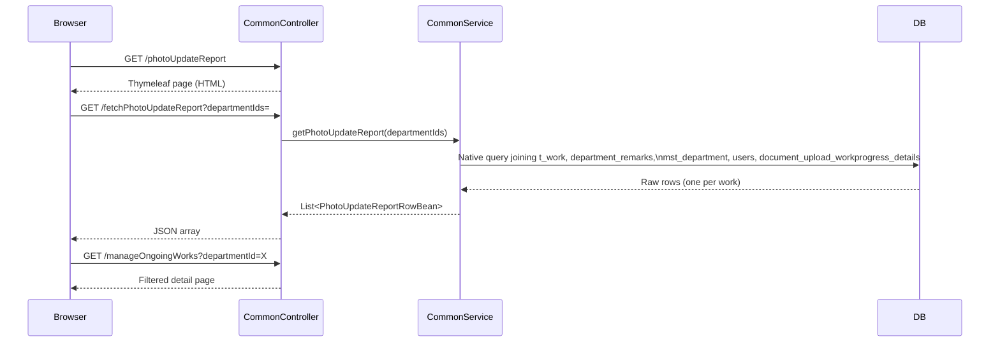

# Design Document: Photo Update Report

## Overview

The Photo Update Report is a summary page that lists active works which had photo uploads (work progress images) in the last 15 days. Each row represents one work, showing its department, work name, total works count for that department (as a hyperlink), area officer, and days since the last photo upload. The page includes a multiselect department filter and follows the same UI conventions as `departmentWiseWorksReport`.

The feature adds:
- A new Thymeleaf template: `common/photoUpdateReport.html`
- Two new endpoints in `CommonController`: page view (`GET /photoUpdateReport`) and data API (`GET /fetchPhotoUpdateReport`)
- A new service method in `CommonService` / `CommonServiceImpl`
- A new native query in `DocumentUploadWorkProgressRepository` (or a new dedicated repository)
- A new response bean `PhotoUpdateReportRowBean`

No new entities or database tables are required.

---

## Architecture



The frontend uses AngularJS (consistent with the rest of the application) to call the data endpoint, populate the table, and build hyperlink URLs.

---

## Components and Interfaces

### Controller: `CommonController`

Two new mappings added to the existing `CommonController`:

```java
// Page view
@RequestMapping(value = "/photoUpdateReport", method = RequestMethod.GET)
public ModelAndView photoUpdateReportView(HttpServletRequest request)

// Data API
@RequestMapping(value = "/fetchPhotoUpdateReport", method = RequestMethod.GET,
                produces = "application/json;charset=UTF-8")
@ResponseBody
public ResponseEntity<?> fetchPhotoUpdateReport(
    @RequestParam(required = false) String departmentIds,
    HttpServletRequest request)
```

`departmentIds` is a comma-separated ID string (e.g. `"1,3,5"`), parsed via the existing `convertToList()` helper already in `CommonController`.

### Service: `CommonService` / `CommonServiceImpl`

New method added to the `CommonService` interface:

```java
List<PhotoUpdateReportRowBean> getPhotoUpdateReport(List<Long> departmentIds);
```

The implementation dispatches to one of two repository query variants depending on whether `departmentIds` is populated, then maps `Object[]` rows to `PhotoUpdateReportRowBean` instances.

### Bean: `PhotoUpdateReportRowBean`

```java
package com.anuppur.bean;

public class PhotoUpdateReportRowBean {
    private Long departmentId;
    private String departmentName;
    private String workName;
    private long totalWorks;       // count of distinct active works for this dept with uploads in last 15 days
    private String areaOfficerName;
    private int days;              // DATEDIFF(CURRENT_DATE, MAX(created_date))
    // getters and setters
}
```

### Repository: `DocumentUploadWorkProgressRepository`

Two new native query methods added (no-filter variant and department-filter variant):

```java
@Query(value = "...", nativeQuery = true)
List<Object[]> fetchPhotoUpdateReportAll();

@Query(value = "...", nativeQuery = true)
List<Object[]> fetchPhotoUpdateReportByDept(@Param("departmentIds") List<Long> departmentIds);
```

### Template: `common/photoUpdateReport.html`

Follows the same structure as `departmentWiseWorksReport.html`:
- Bootstrap 3 + bootstrap-select for the department multiselect dropdown
- AngularJS for data loading, filter application, and hyperlink URL construction
- Table columns: S.No, Department Name, Work Name, Total Works, Area Officer Name, Days
- `Total Works` cell rendered as `<a data-ng-href="...">{{row.totalWorks}}</a>` linking to `manageOngoingWorks?departmentId={{row.departmentId}}`

---

## Data Models

### Existing tables used

| Table | Key columns used |
|---|---|
| `t_work` | `id`, `work_name`, `status` (= `'Active'`), `user_id` (FK → `users.id`) |
| `department_remarks` | `work_id` (FK → `t_work.id`), `department_master_id` (FK → `mst_department.id`), `enabled` |
| `mst_department` | `id`, `name`, `enabled` |
| `users` | `id`, `first_name`, `last_name` |
| `document_upload_workprogress_details` | `work_id` (FK → `t_work.id`), `created_date` |

### Department resolution

Each work may have multiple `department_remarks` rows. The design uses the first enabled record per work (lowest `id` with `enabled = 1`) to derive the department name, consistent with how other reports in the codebase handle this join.

### Aggregation query (native SQL)

The query returns one row per active work that had at least one photo upload in the last 15 days. The `totalWorks` column is a window-style count of distinct works per department computed in the same query.

```sql
SELECT
    d.id                                                        AS departmentId,
    d.name                                                      AS departmentName,
    w.work_name                                                 AS workName,
    COUNT(DISTINCT w2.id) OVER (PARTITION BY d.id)             AS totalWorks,
    CONCAT(IFNULL(u.first_name, ''), ' ', IFNULL(u.last_name, '')) AS areaOfficerName,
    DATEDIFF(CURRENT_DATE, MAX(p.created_date))                AS days
FROM t_work w
JOIN (
    SELECT dr_inner.work_id, dr_inner.department_master_id
    FROM department_remarks dr_inner
    WHERE dr_inner.enabled = 1
      AND dr_inner.id = (
          SELECT MIN(dr2.id)
          FROM department_remarks dr2
          WHERE dr2.work_id = dr_inner.work_id AND dr2.enabled = 1
      )
) dr ON dr.work_id = w.id
JOIN mst_department d ON d.id = dr.department_master_id AND d.enabled = 1
JOIN document_upload_workprogress_details p ON p.work_id = w.id
LEFT JOIN users u ON u.id = w.user_id
JOIN t_work w2 ON w2.status = 'Active'
    AND w2.id IN (
        SELECT DISTINCT p2.work_id
        FROM document_upload_workprogress_details p2
        WHERE p2.created_date >= DATE_SUB(CURRENT_DATE, INTERVAL 14 DAY)
    )
    AND w2.id IN (
        SELECT dr3.work_id FROM department_remarks dr3
        WHERE dr3.department_master_id = d.id AND dr3.enabled = 1
    )
WHERE w.status = 'Active'
  AND p.created_date >= DATE_SUB(CURRENT_DATE, INTERVAL 14 DAY)
  -- optional department filter applied in variant query:
  -- AND d.id IN (:departmentIds)
GROUP BY d.id, d.name, w.id, w.work_name, u.first_name, u.last_name
ORDER BY d.name ASC
```

> **Note on window function compatibility**: If the target MySQL version does not support window functions (`OVER (PARTITION BY ...)`), `totalWorks` is computed as a correlated subquery instead:
> ```sql
> (SELECT COUNT(DISTINCT w2.id)
>  FROM t_work w2
>  JOIN department_remarks dr3 ON dr3.work_id = w2.id AND dr3.department_master_id = d.id AND dr3.enabled = 1
>  JOIN document_upload_workprogress_details p2 ON p2.work_id = w2.id
>  WHERE w2.status = 'Active'
>    AND p2.created_date >= DATE_SUB(CURRENT_DATE, INTERVAL 14 DAY)
> ) AS totalWorks
> ```

### `PhotoUpdateReportRowBean` (new)

Fields: `departmentId` (Long), `departmentName` (String), `workName` (String), `totalWorks` (long), `areaOfficerName` (String), `days` (int).

---

## Correctness Properties

*A property is a characteristic or behavior that should hold true across all valid executions of a system — essentially, a formal statement about what the system should do. Properties serve as the bridge between human-readable specifications and machine-verifiable correctness guarantees.*

### Property 1: Only Active works appear

*For any* result set returned by the photo update report API, every row must correspond to a work where `t_work.status = 'Active'`. No row with a non-Active status should ever appear in the result.

**Validates: Requirements 1.3, 4.1, 4.2**

### Property 2: Area officer name is correct concatenation

*For any* work in the result that has a `userAssignee` set, the `areaOfficerName` field must equal the concatenation of `first_name` and `last_name` from the `users` table for that user ID.

**Validates: Requirements 1.5**

### Property 3: Days value matches MAX(created_date) calculation

*For any* work in the result, the `days` field must equal `DATEDIFF(CURRENT_DATE, MAX(created_date))` computed over all `document_upload_workprogress_details` records for that work within the last 15 days.

**Validates: Requirements 1.6**

### Property 4: Only uploads within last 15 days are considered

*For any* photo upload record, it should only contribute to the result if its `created_date >= CURRENT_DATE - 14 days`. Works whose only uploads are older than 14 days must not appear in the result.

**Validates: Requirements 5.2**

### Property 5: Total Works count is correct per department

*For any* department in the result, the `totalWorks` value must equal the count of distinct active works for that department that had at least one photo upload in the last 15 days.

**Validates: Requirements 5.3**

### Property 6: Department filter narrows result set

*For any* non-empty list of department IDs passed as a filter, every row in the returned result must have a `departmentId` that is contained in the filter list.

**Validates: Requirements 3.3, 6.3**

### Property 7: Total Works hyperlink contains correct departmentId

*For any* row in the result with department ID `D`, the Total Works hyperlink URL must contain `departmentId=D` as a query parameter.

**Validates: Requirements 2.1, 2.2, 2.4**

### Property 8: Results are ordered by department name ascending

*For any* result set returned by the API, the sequence of `departmentName` values must be in non-decreasing alphabetical order.

**Validates: Requirements 6.5**

---

## Error Handling

| Scenario | Handling |
|---|---|
| Database error during query | `CommonServiceImpl` catches `Exception`, logs it, re-throws as `RuntimeException`; controller catches and returns HTTP 500 with `{"errorMessage": "..."}` |
| Invalid (non-numeric) `departmentIds` | `convertToList()` throws `NumberFormatException`; controller catches and returns HTTP 400 |
| No qualifying works | Returns empty JSON array `[]`; frontend shows "No data available" row |
| Work has no `userAssignee` | `areaOfficerName` is returned as empty string or `null`; frontend renders blank |
| Work has no department_remarks | Work is excluded from results (inner join on department_remarks) |

---

## Testing Strategy

### Unit tests

- `CommonServiceImpl.getPhotoUpdateReport()` with mocked repository:
  - Empty department list → returns all qualifying rows
  - Non-empty department list → only those departments returned
  - Repository throws exception → RuntimeException propagated
- `PhotoUpdateReportRowBean` field mapping: verify all 6 fields are correctly mapped from `Object[]`
- `convertToList()` with null, empty string, single value, comma-separated values, invalid string (already tested by existing suite)

### Property-based tests

Use **jqwik** (Java property-based testing library) with minimum 100 tries per property.

Each test is tagged with: `// Feature: photo-update-report, Property N: <property text>`

**Property test 1** — Only Active works appear
```java
// Feature: photo-update-report, Property 1: only Active works appear
@Property
void onlyActiveWorksAppear(@ForAll List<WorkFixture> works) {
    // Seed mock repository with works of mixed statuses
    // Call getPhotoUpdateReport(null)
    // Assert every returned row's workId maps to a work with status='Active'
}
```

**Property test 3** — Days value matches MAX(created_date)
```java
// Feature: photo-update-report, Property 3: days equals DATEDIFF(today, MAX(created_date))
@Property
void daysMatchesMaxCreatedDate(@ForAll List<UploadFixture> uploads) {
    // For each work in result, compute expected days from generated uploads
    // Assert result.days == DATEDIFF(today, max(upload.createdDate))
}
```

**Property test 4** — Only uploads within last 15 days are considered
```java
// Feature: photo-update-report, Property 4: uploads older than 14 days are excluded
@Property
void oldUploadsExcluded(@ForAll List<UploadFixture> uploads) {
    // Ensure works with only uploads older than 14 days do not appear in result
}
```

**Property test 5** — Total Works count is correct per department
```java
// Feature: photo-update-report, Property 5: totalWorks equals distinct active works with recent uploads
@Property
void totalWorksCountIsCorrect(@ForAll List<WorkFixture> works) {
    // For each department in result, count expected totalWorks from fixture data
    // Assert result.totalWorks == expected count
}
```

**Property test 6** — Department filter narrows result set
```java
// Feature: photo-update-report, Property 6: department filter narrows result set
@Property
void departmentFilterNarrowsResults(@ForAll @Size(min=1) List<Long> deptIds) {
    List<PhotoUpdateReportRowBean> result = service.getPhotoUpdateReport(deptIds);
    result.forEach(row -> assertTrue(deptIds.contains(row.getDepartmentId())));
}
```

**Property test 8** — Results ordered by department name ascending
```java
// Feature: photo-update-report, Property 8: results ordered by department name ascending
@Property
void resultsOrderedByDepartmentName(@ForAll List<Long> deptIds) {
    List<PhotoUpdateReportRowBean> result = service.getPhotoUpdateReport(deptIds);
    for (int i = 1; i < result.size(); i++) {
        assertTrue(result.get(i-1).getDepartmentName()
            .compareTo(result.get(i).getDepartmentName()) <= 0);
    }
}
```

Unit tests cover example-based cases: empty result renders "No data available", HTTP 400 on bad params, HTTP 500 on DB error, null `areaOfficerName` when no assignee, and the Total Works hyperlink URL format.
